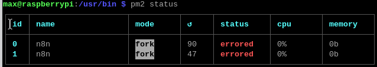
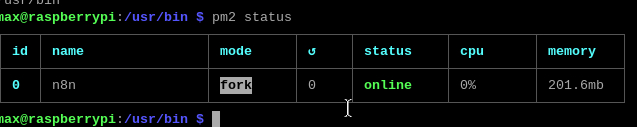
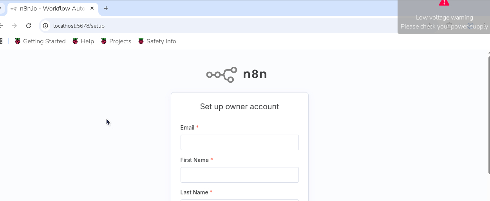
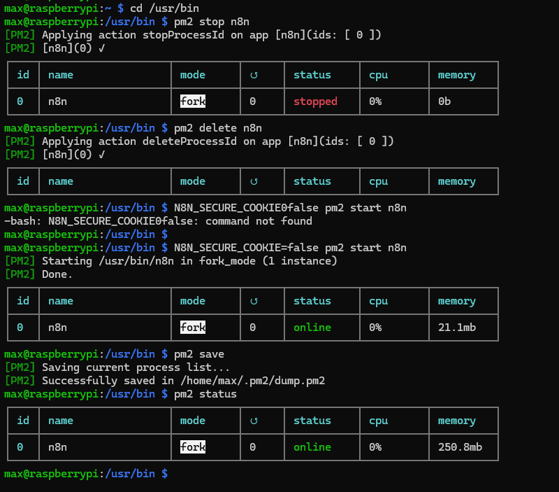
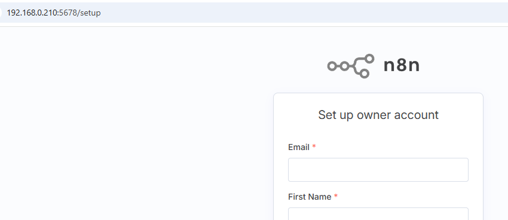

¡Claro\! La forma más común de instalar **n8n** en una Raspberry Pi (que usa Linux) es utilizando **npm** (Node Package Manager).

Aquí tienes los comandos de instalación paso a paso:

-----

## 1\. Actualizar el Sistema

Es importante que tu Raspberry Pi esté completamente actualizada antes de comenzar.

```bash
sudo apt update && sudo apt upgrade -y
```

-----

## 2\. Instalar Node.js y npm

n8n está construido sobre Node.js, por lo que debes instalarlo junto con npm (el gestor de paquetes de Node). Se recomienda una versión LTS (Long-Term Support).

1.  **Descargar e instalar el repositorio de Node.js (por ejemplo, la versión 18.x):**

    ```bash
    curl -sL https://deb.nodesource.com/setup_18.x | sudo -E bash -
    ```

2.  **Instalar Node.js:**

    ```bash
    sudo apt install -y nodejs
    ```

3.  **Verificar las versiones instaladas:**

    ```bash
    node -v
    npm -v
    ```

    (Deberías ver las versiones de Node y npm).

-----

## 3\. Instalar n8n Globalmente

Usa npm para instalar n8n de forma global en tu Raspberry Pi.

```bash
sudo npm install -g n8n
```

-----

## 4\. Iniciar y Acceder a n8n

Una vez instalado, puedes iniciarlo para hacer una prueba.

1.  **Iniciar n8n:**

    ```bash
    n8n start
    ```

    *Nota: Esto iniciará n8n en primer plano. Para un uso a largo plazo, se recomienda configurarlo como un servicio del sistema (ver sección 5).*

2.  **Acceder a la interfaz web:**

    Por defecto, n8n se ejecuta en el puerto `5678`. Abre un navegador web en otro dispositivo de tu red y navega a:

    ```
    http://<Tu_Dirección_IP_de_Raspberry_Pi>:5678
    ```

    *Reemplaza `<Tu_Dirección_IP_de_Raspberry_Pi>` con la IP real de tu dispositivo.*

-----

## 5\. (Opcional, pero recomendado) Configurar n8n como un Servicio del Sistema con PM2

Para que n8n se ejecute en segundo plano de forma fiable y se inicie automáticamente cuando se reinicia la Pi, puedes usar un gestor de procesos como **PM2**.

1.  **Instalar PM2 globalmente:**

    ```bash
    sudo npm install -g pm2
    ```

2.  **Iniciar n8n con PM2:**

    ```bash
    pm2 start n8n
    ```

3.  **Hacer que PM2 inicie n8n al arrancar el sistema:**

    ```bash
    pm2 save
    pm2 startup
    ```

    *El comando `pm2 startup` te dará un comando que deberás ejecutar (probablemente con `sudo`) para configurar el inicio automático.*

4.  **Comandos útiles de PM2:**

      * Ver el estado de n8n: `pm2 status`
      * Ver los logs: `pm2 logs n8n`
      * Detener n8n: `pm2 stop n8n`
      * Reiniciar n8n: `pm2 restart n8n`

Con esto, tendrás **n8n** funcionando de forma continua en tu Raspberry Pi. ¡A automatizar\! 🚀

## 6\. Correccion de errores paso 5

PM2 no lograba guardar la configuracion con el siguiente error

```
npm error enoent Could not read package.json: Error: ENOENT: no such file or directory, open '/home/max/package.json'
```

```
0. pm2 logs -> veras el log anterior
1. which n8n -> encontrar la ubicacion
2. cd /usr/bin -> en mi caso debi pararme sobre esta ubicacion
3. pm2 start n8n -> responde con la ejecucion de un comando para modificar una variable de entorno
4. sudo env PATH=$PATH:/home/max/.nvm/versions/node/v20.19.5/bin /usr/lib/node_modules/pm2/bin/pm2 startup systemd -u max --hp /home/max
5. pm2 save
6. pm2 status
```

## Imágenes de referencia

A continuación se muestran imágenes que ilustran algunos de los pasos descritos:

*Error en status.*


*correccion despues de los pasos mencionados*


*Interfaz web de n8n ejecutándose en el navegador.*



## 7\. Correccion error acceso por red Interna

Error
```
Your n8n server is configured to use a secure cookie,
however you are either visiting this via an insecure URL, or using Safari.

To fix this, please consider the following options:
Setup TLS/HTTPS (recommended), or
If you are running this locally, and not using Safari, try using localhost instead
If you prefer to disable this security feature (not recommended), set the environment variable N8N_SECURE_COOKIE to false

```

```
0. cd /usr/bin
1. pm2 stop n8n
2. pm2 delete n8n
3. N8N_SECURE_COOKIE=false pm2 start n8n
4. pm2 save
5. pm2 status

```

*ejecucion de comandos para corregir.*


*Interfaz web de n8n ejecutándose en el navegador dentro de la red.*
